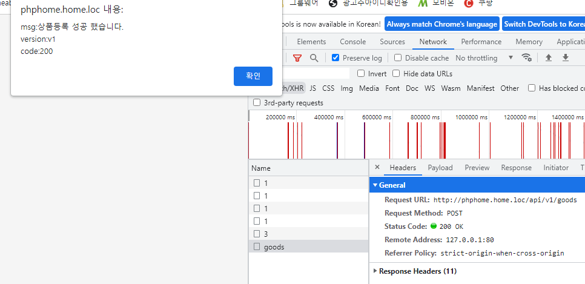

# 무신사 코딩
## 과제 내용
 - 셈플 스키마를 참고하여 스키마를 완성합니다.
 - 평소 개발하시는 개발환경을 기반으로 REST API를 개발합니다. (ex : Laravel, Codeigniter)
 - 버저닝에 대한 고려가 되어야 합니다.
 - 비정상적인 API 호출의 에러처리에 대해 고려되어야 합니다. (throttling)
 - 상품 API가 저장되는 저장소 혹은 방식은 추후 변경이 될 수 있다는 가정합니다.
 - 인증은 고려하지 않습니다

### 테이블 스키마
```sql
CREATE TABLE `goods` (
  `goods_no` int(11) NOT NULL AUTO_INCREMENT COMMENT '상품번호',
  `goods_nm` varchar(100) DEFAULT NULL COMMENT '상품명',
  `goods_cont` text DEFAULT NULL COMMENT '상품설명',
  `com_id` varchar(20) DEFAULT NULL COMMENT '업체 아이디',
  `reg_dm` datetime DEFAULT now() COMMENT '상품정보 최초등록일시',
  `upd_dm` datetime DEFAULT now() COMMENT '상품정보 수정일시',
  PRIMARY KEY (`goods_no`)
) ENGINE=InnoDB AUTO_INCREMENT=0 DEFAULT CHARSET=utf8 COMMENT='상품마스터'
```
```
    goods_no 에 auto increment 를 추가 했습니다.
    reg_dm,upd_dm 에 기본값 now() 를 추가 했습니다.
```

등록 페이지 : (GET) /goods/create

<hr>

등록 api : (POTS) /api/v1/goods

<hr>

리스트(조회) 페이지 : (GET) /goods

<hr>

조회 api : (GET) /api/v1/goods/1


